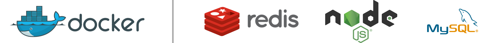

<p align="center">
  
</p>
<hr>
<p align="center">
  <strong>Runs on</strong>
  <br>
  <br>
  
</p>
<hr>

## What is Milena Auth?

Milena Auth is the authentication system to be used by Fluoretto services. It provides a custom integration of different services Fluoretto provides, creating
a unique, seamless user experience.

## Running

### Requirements

To run Milena in your machine, you must have installed

- [Docker](https://www.docker.com/)
- [Node.JS 12+](https://nodejs.org/en/)
- [Yarn](https://yarnpkg.com/)

### Steps to run in development environment

First, copy `docker-compose.dev.yml` to `docker-compose.override.yml`.

```bash
$ cp docker-compose.dev.yml docker-compose.override.yml
```

Add the required secrets into `./secrets` directory.

Run `yarn` to install dependencies.

Run `docker-compose up` to run Milena.

### Documentation

Check docs [here](./docs/assets/README.md).
